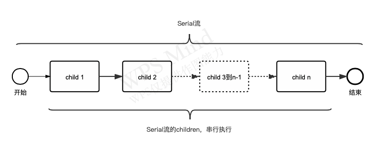
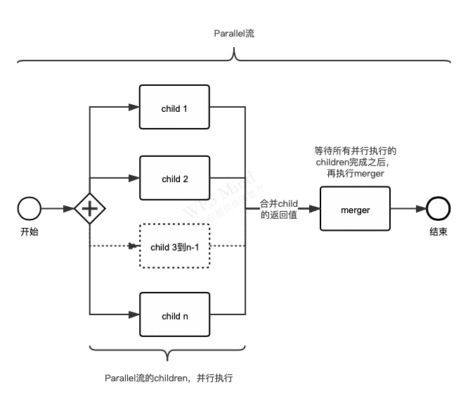
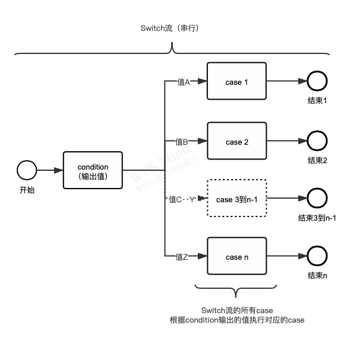
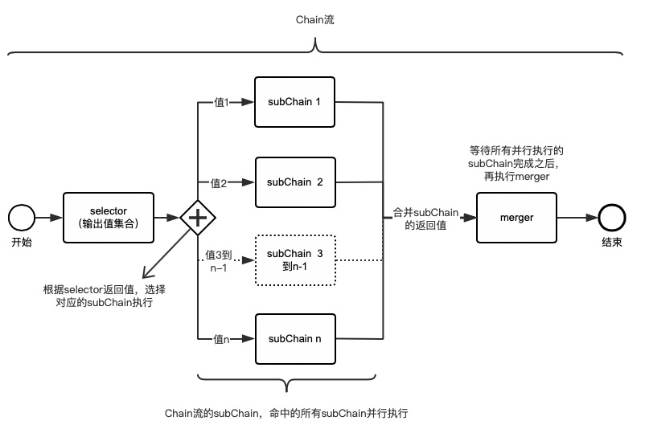
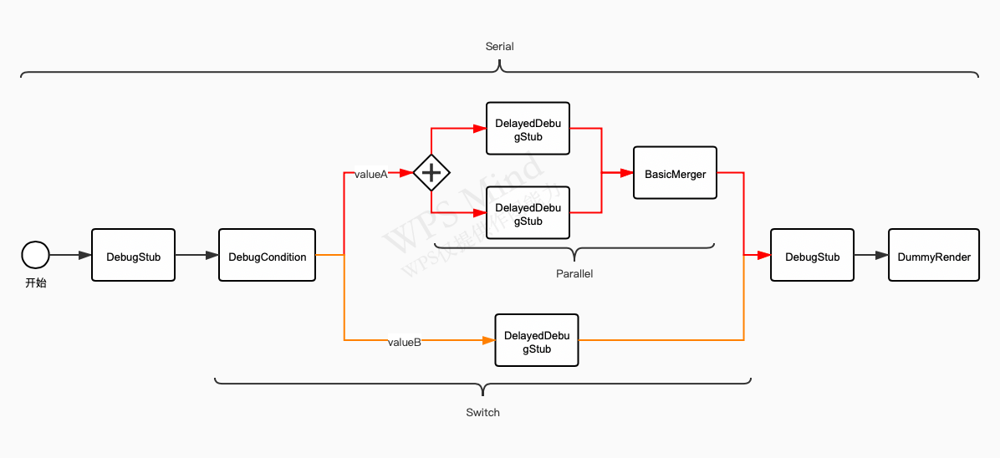

# 目录

- [目录](#目录)
- [一、背景](#一背景)
  - [1.目标](#1目标)
  - [2.三方库](#2三方库)
- [二、框架设计](#二框架设计)
  - [1.processor基本结构](#1processor基本结构)
    - [basic processor（基本单元）](#basic-processor基本单元)
    - [Serial流（组合单元）](#serial流组合单元)
    - [Parallel流（组合单元）](#parallel流组合单元)
    - [Switch流（组合单元）](#switch流组合单元)
    - [Chain流（组合单元）](#chain流组合单元)
- [三、代码编写和API调用](#三代码编写和api调用)
  - [1.所有自定义Processor的基类](#1所有自定义processor的基类)
  - [2.Processor的变量自动注入](#2processor的变量自动注入)
  - [3.通过HOCON文件配置processor业务流](#3通过hocon文件配置processor业务流)
    - [a) 内置的公共结构](#a-内置的公共结构)
    - [b) 定义一个具体的processor](#b-定义一个具体的processor)
    - [c) 定义一个串行业务流](#c-定义一个串行业务流)
    - [d) 定义一个并行业务流](#d-定义一个并行业务流)
    - [e) 定义一个switch业务流](#e-定义一个switch业务流)
    - [f) 定义一个chain业务流](#f-定义一个chain业务流)
    - [g) 定义一个组合的业务流](#g-定义一个组合的业务流)
  - [4.执行自己编写的业务流](#4执行自己编写的业务流)
- [四、建议](#四建议)


# 一、背景

## 1.目标

1.使用异步非阻塞模型，达到充分利用CPU的目的<br/>
2.结构化processor编程，支持通过HOCON配置文件编写processor的业务流程（支持并行或串行）<br/>
3.无线程调度代码编写<br/>
3.支持通过HOCON配置文件编写单个processor的参数配置<br/>
4.支持通过bean容器的方式获取processor实例<br/>

## 2.三方库

1.project reactor，支持反应式异步编程的基础库，官网：[**Project Reactor**](https://projectreactor.io/)<br/>
2.typesafe config，类json的HOCON配置文件解析库（支持变量定义、变量引用和配置继承，以及环境变量读取），[**github地址**](https://github.com/lightbend/config)<br/>

# 二、框架设计

## 1.processor基本结构

### basic processor（基本单元）
 
> 基础的逻辑处理单元，执行具体业务逻辑的processor

可以继承抽象类，实现自定义的processor业务逻辑。

### Serial流（组合单元）
 
> Serial模式下的所有child单元都是串行执行的
>
> 每个child既可以是basic processor，也可以是任意的组合单元（Serial、Parallel等）



### Parallel流（组合单元）
 
> Parallel模式下的所有child单元都是并行执行的
>
> 等待children执行完成后，会执行merger单元（相当于children和merger是串行）
>
> merger和每个child既可以是basic processor，也可以是任意的组合单元（Serial、Parallel等）

Parallel的merge模式有三种：ALL，ANY或指定child。 <br>
ALL: 等待所有child执行完毕才执行merger <br>
ANY: 任意child执行完毕就执行merger <br>
指定child: 等待指定child执行完毕且数据不为empty就执行merger，否则fall back到ALL模式



### Switch流（组合单元）
 
> Switch模式的子单元都是串行执行的
>
> 先执行condition单元，然后根据它的返回值判断走哪条case单元
>
> condition和每个case既可以是basic processor，也可以是任意的组合单元（Serial、Parallel等）



### Chain流（组合单元）
 
> Chain模式的子单元都是并行执行的
>
> 先执行selector单元，然后根据它的返回值判断走哪些subChain单元。等待subChain执行完成后，会执行merger单元
>
> selector、merger和每个subChain既可以是basic processor，也可以是任意的组合单元（Serial、Parallel等）



# 三、代码编写和API调用

## 1.所有自定义Processor的基类
```java
public abstract class BasicProcessor<C extends Context> implements Processor<C> {

    /**
     * @param context 上下文信息
     * @param predecessors  前置Processor的返回结果
     * @param processorConfig   Processor配置，从HOCON文件映射来的
     * @return Processor返回结果
     */
    protected abstract Mono<Object> process(C context, List<Object> predecessors,
        ProcessorConfig processorConfig);
}
```

> 所有自定义的业务Processor都要继承此类，然后就可以写到HOCON配置文件中的class。
> 目前内置的基础抽象processor类除BasicProcessor之外，还有ConditionProcessor、BasicMerger、Filter、Preparer、Ruler、ReactiveFilter、ReactiveRuler、SelectorProcessor

> context上下文对象会在每次执行业务流的时候构造，并在业务流中的Processor间传递。
> predecessors是前置Processor的返回结果：
> 
> 前置为BasicProcessor，则predecessors为前置BasicProcessor的结果；
>
> 前置为Serial，则predecessors为Serial最后一个processor的结果；
>
> 如果是Parallel的merger，则predecessors为Parallel所有children的结果；
>
> 前置为Parallel，则predecessors为Parallel的merger processor的结果；
>
> 如果是Switch的case，则predecessors为Switch的condition的结果；
>
> 前置为Switch，则predecessors为Switch命中的case的结果；
>
> 如果是Chain的merger，则predecessors为Chain所有执行了的subChain的结果；
>
> 前置为Chain，则predecessors为Chain的merger processor的结果；

## 2.Processor的变量自动注入

```java
public class DebugStub extends BasicProcessor<Context> {
    @Parameter
    private String msg;

    @Override
    protected Mono<Object> process(Context context, List<Object> predecessors,
        ProcessorConfig processorConfig) {
        log.info(String.format("DebugStub(%s): %s", Math.random(), msg));
        return Mono.empty();
    }
}
```
> 通过添加`@Parameter`注解，框架会自动将HOCON配置文件中对应的值注入到msg变量当中，变量类型可以是Map、List、Set以及任意自定义的类

## 3.通过HOCON文件配置processor业务流

*如果使用idea的IDE，可以下载一个HOCON的插件，方便点击类名或HOCON变量名直接跳转到定义处*


### a) 内置的公共结构

> 包括basic、serial、parallel等几种类型，在自定义的conf文件中直接include就行
>
> 文件位于jar资源根目录下，引用的时候注意目录层次

`flux-common.conf`
```yaml
// 基础processor，请继承这个配置
// timeout是超时时间
basic {
  timeout = 1000ms
}
// 用于调度，请不要覆盖 class
// 需要指定 children
serial = ${basic}{
  class = Serial
  children = []
}
// 用于调度，请不要覆盖 class
// 需要指定 children 和 merger
parallel = ${basic}{
  class = Parallel
  children = []
  merger = ${basic}{class = BasicMerger}
}
// 用于调度，请不要覆盖 class
// 需要指定 condition 和 cases
switch = ${basic}{
  class = Switch
  condition = {}
  cases = {}
}
// 用于调度，请不要覆盖 class
// 需要指定 selector、subChain 和 merger
chain = ${basic}{
  class = SubChain
  selector = {}
  subChain = {}
  merger = ${basic}{class = BasicMerger}
}
```

### b) 定义一个具体的processor

`processor_practice.conf`
```yaml
include "flux-common.conf"

myProcessor = ${basic}{
  class = com.epilogue.framework.flux.processor.core.MyProcessor
  timeout = 50ms  # 覆盖basic中的默认值1000ms
  param1 = xxx    # 可以自动将param1的值注入到MyProcessor里面的param1变量
  param2 = xxx    # 可以自动将param2的值注入到MyProcessor里面的param2变量
}
```

### c) 定义一个串行业务流

> MyProcessor、OtherProcessor、AnotherProcessor串行执行

`serial_practice.conf`
```yaml
include "processor_practice.conf"

serial_practice = ${serial}{
  children = [
    ${myProcessor}  # 引用processor_practice.conf里面的processor定义
    ${basic}{
      class = com.epilogue.framework.flux.processor.core.OtherProcessor
    }
    ${basic}{
      class = com.epilogue.framework.flux.processor.core.AnotherProcessor
    }
  ]
}
```

### d) 定义一个并行业务流

> MyProcessor、OtherProcessor、AnotherProcessor并行执行，它们执行完之后再执行MyMerger
> 
> merge模式通过latch参数指定，取值为ALL、ANY 或 0到n-1（代表指定第n个child），默认值为ALL，参考 **[Parallel流（组合单元）](#parallel流组合单元)**

`parallel_practice.conf`
```yaml
include "processor_practice.conf"

parallel_practice = ${parallel}{
  latch = ALL  # 指定merge模式
  children = [
    ${myProcessor}  # 引用processor_practice.conf里面的processor定义
    ${basic}{
      class = com.epilogue.framework.flux.processor.core.OtherProcessor
    }
    ${basic}{
      class = com.epilogue.framework.flux.processor.core.AnotherProcessor
    }
  ]
  merger = ${basic}{  # 覆盖parallel中的默认值merger(BasicMerger)
    class = com.epilogue.framework.flux.processor.core.MyMerger
  }
}
```

### e) 定义一个switch业务流

> 先执行MyCondition，根据MyCondition执行的返回值再执行cases里面对应processor chain

`switch_practice.conf`
```yaml
include "processor_practice.conf"

switch_practice = ${switch}{
  condition = ${basic}{class = com.epilogue.framework.flux.processor.core.MyCondition}  # 只能返回valueA或valueB，否则抛异常
  cases = {
    valueA = ${myProcessor}  # 引用processor_practice.conf里面的processor定义
    valueB = ${basic}{
      class = com.epilogue.framework.flux.processor.core.CaseBProcessor
    }
  }
}
```

### f) 定义一个chain业务流

> 先执行MySelector，根据MySelector执行的返回值集合再并行执行subChain里面对应的那些processor chain，最后执行MyMerger
>
> selector一定要返回Map<String, Context>或Map<String, List<Context>>类型，map中的key是一个selector value，value是Context对象或Context对象的列表
> 每一个Context对象的实例都会调用一次对应的subChain，并作为subChain的context传递下去
>
> 所以subChain中使用的是selector返回的context，selector和merge中使用的是当前chain中的context

`MySelector.java`
```java
public class MySelector extends BasicProcessor<Context> {

    @Override
    protected Mono<Object> process(Context context, List<Object> predecessors,
        ProcessorConfig processorConfig) {
        Map<String, Context> selectorValueMap = new HashMap<>();
        selectorValueMap.put("valueA", new Context());
        selectorValueMap.put("valueB", new Context());
        return Mono.just(selectorValueMap);
    }
}
```

`chain_practice.conf`
```yaml
include "processor_practice.conf"

switch_practice = ${switch}{
  selector = ${basic}{class = com.epilogue.framework.flux.processor.core.MySelector}  # 只能返回valueA、valueB和valueC的集合，否则抛异常
  subChain = {
    valueA = ${myProcessor}  # 引用processor_practice.conf里面的processor定义
    valueB = ${basic}{
      class = com.epilogue.framework.flux.processor.core.ChainBProcessor
    }
    valueC = ${basic}{
      class = com.epilogue.framework.flux.processor.core.ChainCProcessor
    }
  }
  merger = ${basic}{  # 覆盖parallel中的默认值merger(BasicMerger)
    class = com.epilogue.framework.flux.processor.core.MyMerger
  }
}
```

### g) 定义一个组合的业务流

`handler_practice.conf`
```yaml
include "flux-common.conf"

delayedStub = ${basic}{   # 定义一个公共的基础Processor，方便复用
  class = DelayedDebugStub
  sleep = 100ms
}

practice = ${serial}{
  children = [
    ${basic}{
      class = DebugStub
    }
    ${switch}{
      condition = ${basic}{class = DebugCondition}
      cases = {
        valueA = ${parallel}{
          children = [
            ${delayedStub}{   # 复用定义的Processor
              sleep = 100ms
            }
            ${delayedStub}{
              sleep = 200ms
            }
          ]
        }
        valueB = ${delayedStub}{
          sleep = 50ms
        }
      }
    }
    ${basic}{
      class = DebugStub
    }
    ${basic}{
      class = com.epilogue.framework.flux.processor.render.DummyRender
    }
  ]
}
```

> **该配置文件描述的processor流涵盖了所有结构，basic、serial、parallel、switch，具体的流程图如下，红色是DebugCondition返回valueA走的分支，橘色是返回valueB走的分支**



## 4.执行自己编写的业务流

当你编写完所有Processor类和HOCON配置文件之后，你就可以构造一个入口对象`ProcessorFramework`，然后调用对应的API执行自己的业务流。

1. 在此之前，你还需要继承`Request`接口构造一个自己的Request类，以及继承`Context`接口构造一个Context上下文类。

2. 然后继承`ContextBuilder`接口构造一个ContextBuilder类，用于将Request类封装成一个Context类。
```java
public interface ContextBuilder {

    Context build(Request request);
}
```

3. 你还可以继承BeanContainer接口定义一个自己的bean容器，用于生成Processor对象（**此步可选**）。
框架默认会提供一个DefaultBeanContainer的实例，通过反射的方式调用Processor的无参构造函数生成对象

4. 生成`ProcessorFramework`，调用如下的构造函数（scheduler是用于Processor调度的线程池，该线程池不能用于执行同步阻塞任务）：

```java
public ProcessorFramework(ContextBuilder contextBuilder, Scheduler scheduler)

public ProcessorFramework(ContextBuilder contextBuilder, BeanContainer beanContainer, Scheduler scheduler)
```

5. 调用API执行业务流。handlerConfig入参是之前定义的HOCON配置文件转化成的Config对象，processWithInfo会返回业务流的执行耗时信息，
如果要销毁ProcessorFramework对象，请先调用shutDown

```java
Mono<Object> process(Request request, Config handlerConfig)

Mono<Tuple2<Object, ProcessInfo>> processWithInfo(Request request, Config handlerConfig)

void shutDown()
```

代码示例：
```java
public class CaseTest {

    public void practice() {
        ProcessorFramework processorFramework = new ProcessorFramework(null);
        // 配置参数
        processorFramework.setFrameworkConfig(FrameworkConfig.builder()
            .publishOnNewThreadWhenStart(true)  // 第一个Processor是否在新线程中运行，默认为false（沿用调用process接口所在的线程）
            .simplifiedTimeInfo(true)           // 简化输出的TimeInfo
            .errorStackTraceDepth(3)            // 减少打印的错误堆栈信息
            .onErrorContinue(true)              // 忽略异常错误，不中断执行
            .build());
        // 获取practice的配置
        Config handlerConfig = ConfigFactory.parseResources("handler_practice.conf").resolve().getConfig("practice");
        // 调用process接口
        Flux<Object> flux = processorFramework.process(new TestContext(), handlerConfig);
        // ...后续处理
    }

    public static class TestContext implements Context {

    }
}
```

# 四、建议

- 该框架适合编写复杂的业务流处理项目，并且大多是IO调用的业务逻辑，传统的数据库增删改查项目不适合使用该框架
- 因为采用异步非阻塞框架，所以不建议在Processor里面编写比较耗时的阻塞代码，如果需要可以单独建一个线程池，
然后在该线程池中执行耗时的代码，然后通过Mono->Sink的方式通知代码执行完成。如下：
```java
public class MyProcessor extends BasicProcessor<Context> {
    private Executor executor = Executors.newFixedThreadPool(4);

    @Override
    protected Mono<Object> process(Context context, List<Object> predecessors,
        ProcessorConfig processorConfig) {
        return Mono.create(sink -> {
            executor.execute(() -> {
                try {
                    // your code
                    sink.success();
                } catch (Exception e) {
                    sink.error(e);
                }
            });
        });
    }
}
```
- 同上，所有远程调用（rpc或http）建议使用异步方式的netty，避免阻塞Processor的调度线程，提高吞吐量。
也可以使用Spring的Webclient以及各个Spring模块的Reactive库